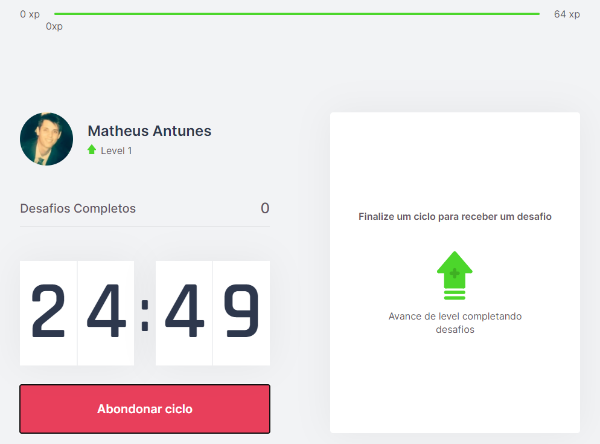
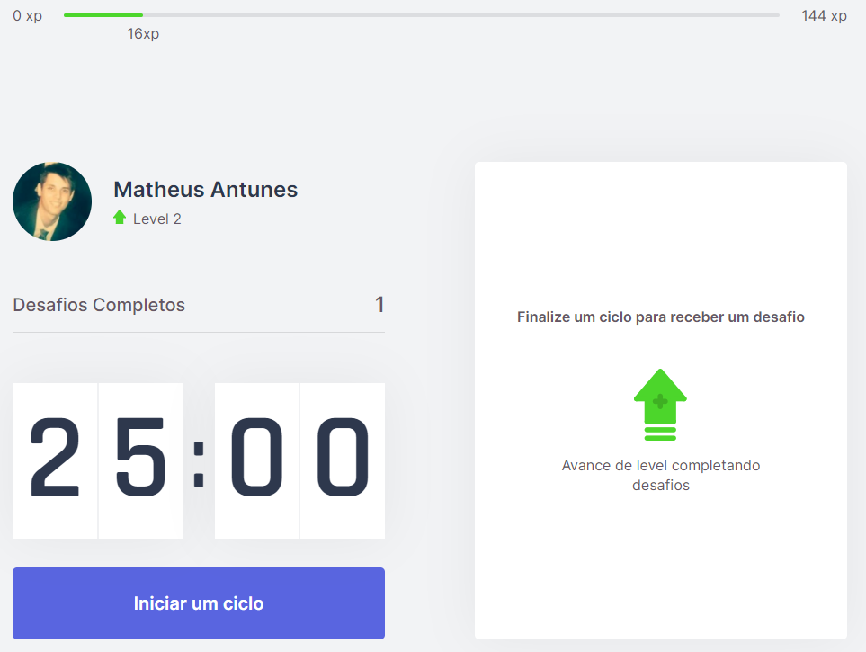
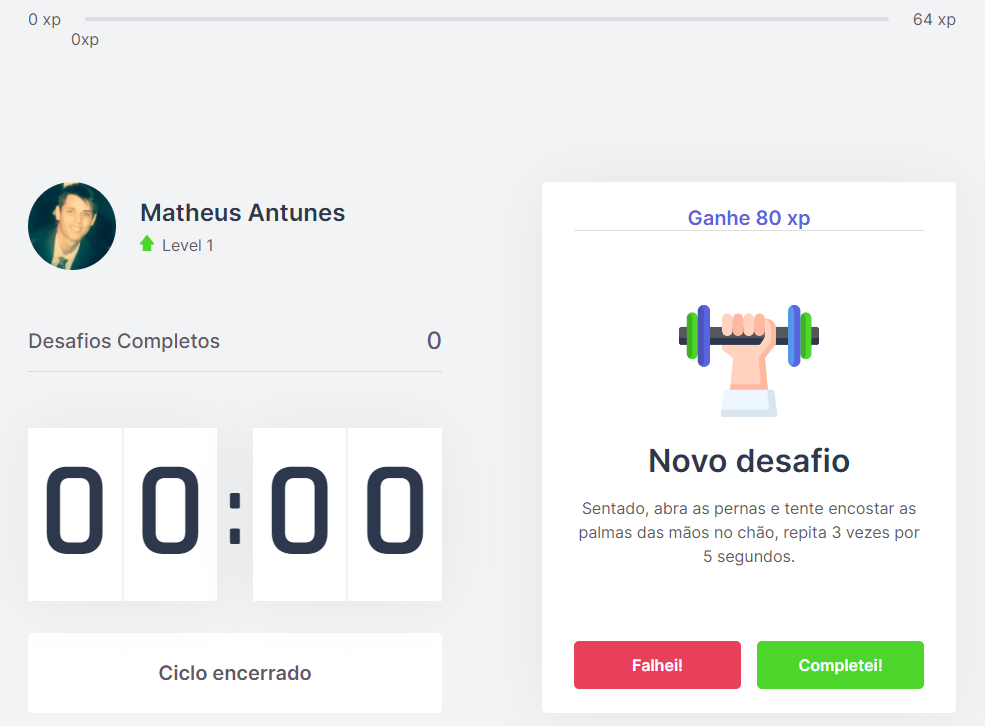

# Health Cycles :heart: :muscle: 

[Link do projeto](https://health-cycles.vercel.app/)

## O projeto consiste atráves de uma gameficação, poder proporcionar que o usuário tenha uma melhora corporal e mental,através de intervalos de tempos para uma pausa em suas atividades e proporcionar um movimento corporal antes da volta de sua respectiva tarefa

### Na aplicação, há uma barra de experiência com pontuações referentes a execução de tarefas (desafios) que são dispostas depois de 25min,para que o usuário saia por alguns momentos de sua atividade atual para fazer alguma atividade física leve.Há a opção de abandonar o ciclo (voltando o tempo inicial) e a assim que mostrada a atividade a ser executada,há um botão para informar que foi completada a tarefa e outro especificando que não foi possível a sua realização (não sendo acrescido pontos à sua barra de experiência.

### É mostrado a quantidade de desafios completos

### Há uma lista de tarefas para execução, como por exemplos:

- "Estique um de seus braços com a palma da mão virada para frente e puxe os dedos para cima por 10 segundos por mão"
- "Puxe o joelho de encontro ao peito e segure, troque de perna após 10 segundos"
- "Em algum ambiente aberto, olhe o mais longe que puder em quatro direções por 3s, mexa apenas os olhos. Repita 3 vezes" 

### A ideia é deixar as tarefas como dinâmicas e que realmente trabalhem vários membros corporais para propiciar uma melhor produtividade de trabalho ao usuário por uma melhor qualidade de saúde pela prática de exercícios cotidianos.